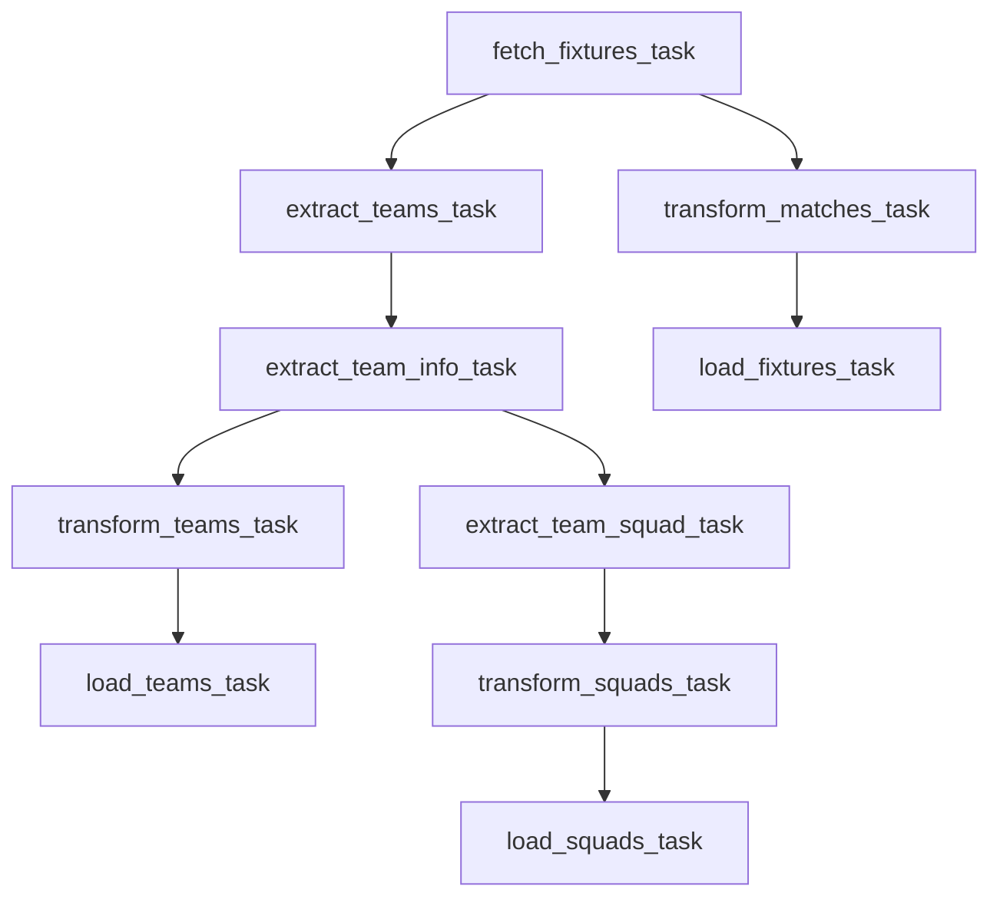

# ⚽ Football ETL Pipeline with Airflow

This project is a full **ETL pipeline** built in Python using Apache Airflow. It extracts football match data from the [API-FOOTBALL](https://www.api-football.com/) API, transforms it using pandas, and loads the structured data into a **PostgreSQL** database hosted on a **Debian Linux server (Alibaba Cloud ECS)**.
---


---

## ✅ Pipeline Status

- ✅ Extract phase – *Fixtures, Teams, Squads*
- ✅ Transform phase – *Null handling, schema cleaning, type conversion*
- ✅ Load phase – *PostgreSQL database*
- 🛠️ Fully orchestrated with Airflow tasks & dependencies

## 📌 Features

- 🔁 Daily scheduled DAG runs
- 🔍 Extracts today's fixtures, participating teams, and full squads
- 🧹 Cleans and transforms raw JSON data into SQL-ready tables
- 🐘 PostgreSQL integration on cloud
- ☁️ Runs on Alibaba Cloud ECS with Linux (Debian)
- 🔗 Modular, extensible Python scripts for testing or future ML

---

## 🛠️ Tech Stack

| Layer         | Tool/Technology         |
|---------------|-------------------------|
| Orchestration | Apache Airflow          |
| Language      | Python 3                |
| Data Source   | API-FOOTBALL.io         |
| Processing    | pandas                  |
| Database      | PostgreSQL              |
| Cloud         | Alibaba Cloud ECS       |
| OS            | Debian Linux            |

---

## 🛠️ Project Structure
```
.
├── dags/
│ └── dag.py # Airflow DAG with all ETL tasks
├── scripts/
│ ├── extract.py # Extract logic: fixtures, teams, squads
│ ├── transform.py # Transform logic: clean, format
│ └── load.py # Load logic: push to PostgreSQL
├── docker-compose.yaml
└── README.md

```


---

## 📥 Extract Phase

Extracts 3 sets of data from the API:

- `fetch_fixtures()` – today’s matches
- `extract_teams_id()` – team IDs from fixtures
- `fetch_teams_info()` – metadata for each team
- `fetch_teams_players_squads()` – player-level data per team

---

## 🔄 Transform Phase

### 🗓 Fixtures Transformation
- Remove rows where `match_id`, `home_team_id`, or `away_team_id` are `null`
- Exclude canceled matches
- Fill missing values with defaults:
  - `country` → `'Unknown'`
  - `venue` → `'Unknown'`
  - `home_team_score` and `away_team_score` → `0`
- Convert fields to appropriate types (e.g., strings, integers) for SQL compatibility

### 🏟 Teams Transformation
- Drop rows with missing `team_id`, `team_name`, or `venue_id`
- Fill missing values with:
  - `team_code` → `'UNK'`
  - `country` → `'Unknown'`
  - `city` → `'Unknown'`
  - `founded` → `0`
  - `venue_name` → `'Unknown'`

### 👥 Squads Transformation
- Fill missing string values such as `name`, `team_name`, and `position`
- Convert and fill numeric fields like `age` and `number` to integers

---
## 🧩 Load Phase

- Load the cleaned `fixtures`, `teams`, and `squads` datasets into PostgreSQL tables
- Connection is securely established to a remote PostgreSQL server hosted on **Debian Linux (Alibaba Cloud)**
---

## 📅 DAG Workflow



---

👤 Author

Zeyad Mohamed

Python Developer | Data Engineer in Progress
