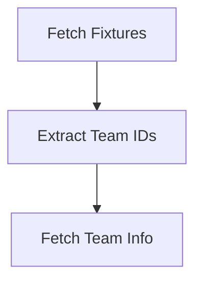

# ⚽ Football ETL Pipeline with Airflow

This project is a **modern ETL pipeline** built in Python using Apache Airflow. It extracts football match data from a free public API, **transforms raw JSON data into business insights**, and will eventually **load structured data into PostgreSQL**, hosted on an Alibaba Cloud Linux server.

> ✅ Currently implemented: `Extract` phase  
> 🔧 In progress: `Transform` & `Load` phases


---

## 📌 Features

- ⏰ **Automated daily DAGs** to fetch football fixtures
- 🔄 Extract unique team IDs and team metadata
- 🌐 Integration with [API-SPORTS Football API](https://www.api-football.com/)
- 🐘 PostgreSQL-ready architecture (upcoming)
- ☁️ Runs on Alibaba Cloud ECS Linux instance
- 🧪 Modular Python scripts for testing & extension

---

## 🔧 Tech Stack

| Layer       | Tool/Technology         |
|-------------|-------------------------|
| Orchestration | Apache Airflow         |
| Language     | Python 3                |
| API Source   | API-SPORTS (football)   |
| Database     | PostgreSQL (planned)    |
| Cloud        | Alibaba Cloud ECS       |
| Scheduler    | Airflow DAG             |

---

## 🛠️ Project Structure
```
.
├── dags/
│   ├── dag.py               # Airflow DAG definition
│   └── scripts/
│       └── extract.py       # Python extract logic
├── docker-compose           
└── README.md                # Project documentation

```


---

## 📥 Extract Phase Logic

The ETL pipeline currently includes:

- **`fetch_fixtures()`**  
  Pulls fixture data for a specific date.

- **`extract_teams_id()`**  
  Extracts all unique team IDs and league metadata.

- **`fetch_team_info()`**  
  Fetches info for all teams using their IDs (with API rate limit compliance).

---

## 📅 DAG Workflow



---

👤 Author

Zeyad Mohamed

Python Developer | Data Engineer in Progress
